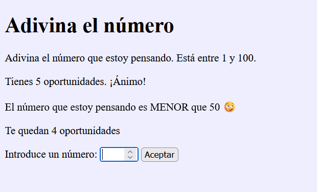
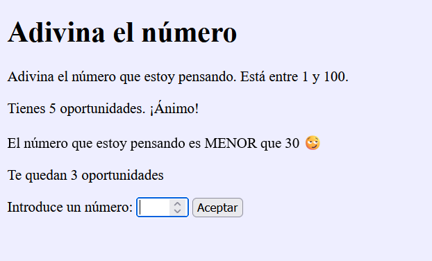
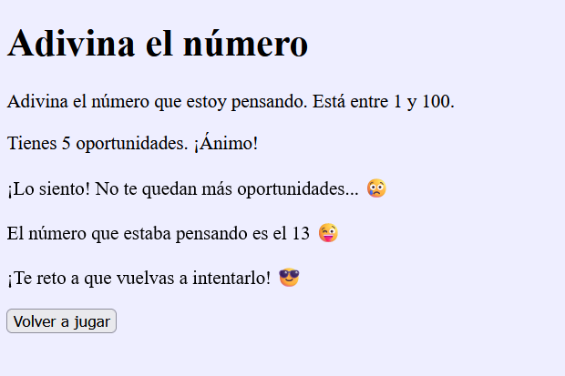

# Juego PHP "Adivina el número"

Juego realizado en **PHP** en el que el usuario intenta adivinar el número que ha pensado el ordenador.

Tendrá <ins>5 intentos</ins> para averiguar el número.

Juega aquí: https://adivina-el-numero-php-12c5a.wasmer.app

## Características del juego

* Realizado en PHP
* Sigue buenas prácticas
* Programado con cariño ❤️
* Adictivo

Dale una ⭐ a este repo si te ha gustado.
